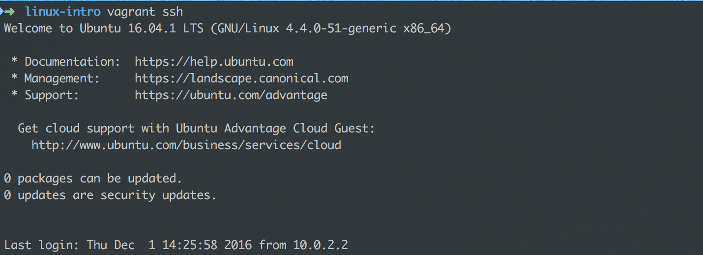
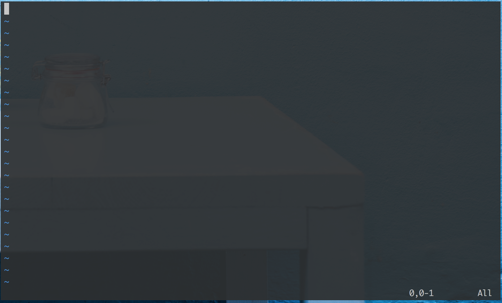
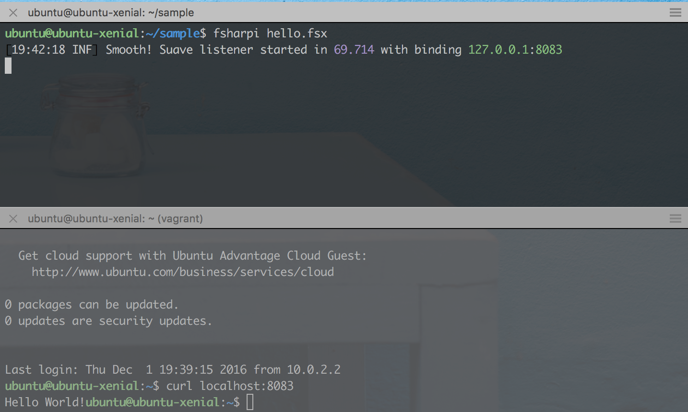

# Linux intro course

This course guides you towards a basic understanding of the linux operating
system with focus on operating servers.

# Table of Contents

  * [Linux intro course](#linux-intro-course)
  * [Table of Contents](#table-of-contents)
    * [Agenda](#agenda)
    * [Introduction](#introduction)
    * [Setting up VirtualBox](#setting-up-virtualbox)
    * [Setting up vagrant](#setting-up-vagrant)
      * [Change directory to linux\-intro\-course](#change-directory-to-linux-intro-course)
      * [Look around](#look-around)
    * [Running the lab machine](#running-the-lab-machine)
    * [SSH\-ing into the machine](#ssh-ing-into-the-machine)
      * [The prompt](#the-prompt)
      * [The home directory](#the-home-directory)
      * [The $](#the-)
      * [Testing boundaries with rm](#testing-boundaries-with-rm)
    * [Becoming <em>root</em>, the user\.](#becoming-root-the-user)
    * [Updating the system with APT](#updating-the-system-with-apt)
      * [Reasoning about changes – interlude](#reasoning-about-changes--interlude)
    * [Installing software with apt](#installing-software-with-apt)
      * [Paginating long output](#paginating-long-output)
      * [Installing F](#installing-f)
    * [Editing files from the command line](#editing-files-from-the-command-line)
      * [Entering intsert mode](#entering-intsert-mode)
      * [Pulling down Suave](#pulling-down-suave)
    * [Running networked software](#running-networked-software)
      * [Running the web server](#running-the-web-server)
      * [Querying the web server](#querying-the-web-server)
      * [Run in background](#run-in-background)
      * [Resume and kill jobs](#resume-and-kill-jobs)
      * [chmod](#chmod)
      * [Collecting the IP numbers](#collecting-the-ip-numbers)
      * [curl from host](#curl-from-host)
      * [Change Suave's binding](#change-suaves-binding)
      * [netstat](#netstat)

## Agenda

- Getting the lab environment set up
- SSH
- Installing software with apt
- Using vim to write text/edit config
- Starting a Suave web server
- Surfing to your Suave web server
- Users & Groups & sudo

## Introduction

In this intro to Linux I'll assume that you know how to start *iTerm* or
*Terminal* on OS X or *PowerShell* on Windows. Don't use `cmd.exe`, it's too
archaic for our needs.

If you have *Git Bash* installed on your machine, then you can use that and do
the OSX/Linux version of the commands.

Here we go!

## Setting up VirtualBox

[Download VirtualBox][virtualbox-dl] from its website. Run the installer so that
you have a way of working with virtualised machines.

## Setting up vagrant

Download [version 1.9.0](https://www.vagrantup.com/downloads.html) at the time
of writing.

Clone this repository: `git clone https://github.com/haf/linux-intro-course.git`

If having trouble due to an HTTPS-MITM-ing proxy, run `git config --global
http.sslVerify false` ([ref][git-https-mitm-fix]), then try again.

### Change directory to `linux-intro-course`

After cloning, change your directory through `cd linux-intro-course`. This
changes your **working directory**. You can check your current directory with
`pwd`, or `(Resolve-Path .).Path` on Windows.

### Look around

Once you've changed your working directory, you can look around: run `ls` to see
all files in the folder you're currently in. You can use `cat` or `type` on
Windows, to write the contents of a file to your terminal.

A terminal (emulator, to be precise) is the interface you're typing commands in.
In daily speech, you "type commands in the *terminal*" or "*execute* things in
the *shell*". In other words, they are used interchangeably.

When working with linux servers, you tend to *print* things to the terminal.
This just means that you write the contents of the file to the terminal, e.g. by
executing `cat filename.txt`.

## Running the lab machine

We'll be learning how to use **Ubuntu 16.04 LTS**. This changes your
**working directory**. Then run `vagrant up` to start the machine.

You'll see output like:

**TBD**

If it queries you for the *interface* to bridge, select the interface with a
local IP on your LAN. You can get the name and configuration of the interface
with `ifconfig` on OS X/Linux and `ipconfig /all` on Windows.

## SSH-ing into the machine

While Vagrant provides good support, even for [bootstrapping][vagrant-vault]
clusters, we'll be using the machine as-is and run all of our commands within
it.

Run `vagrant ssh` to connect to the machine over Secure Shell (SSH). This is
called "sshing" in common speech.

.

### The prompt

Now you'll see what's called a *prompt*:

    ubuntu@ubuntu-xenial:~$

This prompt can be customised to a large extent through the files that are
loaded upon *login*. Right now you're looking at the default configuration of
the *shell*, which is the interpreter for your commands.

In the above line of output, the part before the `@` sign is the *username* of
the current user (defaults to *ubuntu*) and the part between the `@`-sign and
the `:` is the name of the machine. In this case the name of the machine is
"ubuntu-zenial".

After the colon comes the current path. In this case it's `~`.

### The home directory

Users normally have a home directory denoted by the environment variable `HOME`.
You can print the home directory by doing this:

    ubuntu@ubuntu-xenial:~$ echo $HOME
    /home/ubuntu
    ubuntu@ubuntu-xenial:~$ pwd
    /home/ubuntu

### The `$`

With the default shell configuration, the `$` means that you're currently
executing things as the specified user. When executing things as an
administrator; root, the dollar changes to a hash, `#`.

Now you're ready to start exploring the operating system. Remember that `cd`
changes directory`, `..` means the parent directory and `.` is the current
directory.

When switching between *root* and the user account, guides like this one tends
to prefix the commands with `#` if you're using *root* or `$` if you're using
a user account. So just think away that symbol in the examples below.

### Testing boundaries with `rm`

Try `cd /` and then `ls -lah` to see all the contents of the root folder. Let's
try to destroy our new machine by removing the kernel, just to see what happens...

    $ cd /
    $ rm vmlinuz
    rm: cannot remove 'vmlinuz': Permission denied
    $

## Becoming *root*, the user.

Phew, the removal of the kernel thankfully didn't succeed. This is because you
tried to do it as a regular user. Now, let's become root; the user with the keys
to the kingdom, by running:

    $ sudo su
    #

**Don't remove the kernel**, but instead let's update the system with the latest
security patches.

## Updating the system with APT

Linux uses a package system that lets packages specify dependencies, provide
their files and execute pre- and post-installation scripts. We'll be using
Ubuntu's Advanced Packing Tool (APT) to perform an update of the system files.

    # apt-get update
    Hit:1 http://archive.ubuntu.com/ubuntu xenial InRelease
    Get:2 http://security.ubuntu.com/ubuntu xenial-security InRelease [102 kB]
    Get:3 http://archive.ubuntu.com/ubuntu xenial-updates InRelease [102 kB]
    ...
    Get:28 http://archive.ubuntu.com/ubuntu xenial-backports/universe Translation-en [1,216 B]
    Fetched 10.8 MB in 2s (4,353 kB/s)
    Reading package lists... Done

In this case there were no updates available. Had there been, you'd be asked to
confirm the update by typing `y` and then pressing ENTER.

### Reasoning about changes – interlude

In all complex systems, changes are what ultimately break the system. But
changes are very often also what keeps the system functional. Without updates
you'll be hacked eventually, but with updates, you have to verify that they work
with your system.

A regular cause of outages for me has been the *nginx* package writing a
`default.conf` file to `/etc/nginx/conf.d/default.conf`, which doesn't
immediately trigger the nginx to reboot. Then a few days later when the nginx
instance is rebooted, it fails to start, because default.conf conflicts with the
production .conf-files in conf.d.

However, [I'm not][latent-config-checker] [alone in experiencing
this][simple-testing]. In the end, the problem needs to be solved by **treating
configuration as code** and **testing your system**.

## Installing software with apt

Now let's install some software. You previously had a look at the `/` folder.
However, `ls` only shows you one level by default, so let's install a util that
visualises the tree structure:

    # apt-get install tree
    # tree -L 2
    .
    ├── bin
    │   ├── bash
    │   ├── btrfs
    │   ├── btrfs-calc-size
    │   ├── btrfsck -> btrfs
    │   ├── btrfs-convert
    │   ├── btrfs-debug-tree
    ...
    │   ├── run -> /run
    │   ├── snap
    │   ├── spool
    │   └── tmp
    └── vmlinuz -> boot/vmlinuz-4.4.0-51-generic

    339 directories, 747 files

### Paginating long output

That was some long output. You had to scroll up to see it, didn't you? Let's
paginate the output with less: `tree -L 2 | less`. The bar symbol `|` takes the
standard output (STDOUT) of the process *tree* and pipes it to the process
*less*.

At the bottom of your terminal, you'll see a colon, `:`. You can now use your
arrow keys or `j` and `k` to scroll up and down.

### Installing F#

Let's see if we can run some code – after all, we're developers. Let's run
`apt-get install fsharp` to get the F# interactive and the ability to compile F#
code.

    # apt-get install fsharp
    # fsharpc
    F# Compiler for F# 4.0 (Open Source Edition)
    Freely distributed under the Apache 2.0 Open Source License

    error FS0207: No inputs specified
    # exit
    $ cd ~
    $ mkdir sample
    $ cd sample

## Editing files from the command line

Now you have F# installed and are in a folder called *sample*. Let's create a
file called 'hello.fsx' with a small editor called *vim*:

    $ vim hello.fsx

Now you've started the *vim* program. You should see something like this on your
screen:

(the table is my desktop background, your mileage may differ!).

### Entering intsert mode

Vim is a modal editor. It means that you can be in a few different modes:
*normal*, *insert*, *visual*, *select*, *command-line* and *ex*. You're currently in the
normal mode, which you get back to by pressing CTRL+C.

To write test, press `i` to enter the insert mode, then type:

    #!/usr/bin/env fsharpi
    #r "./lib/net40/Suave.dll"
    open Suave
    startWebServer defaultConfig (Successful.OK "Hello World!")

Now, press CTRL+C to enter the *normal* mode again. You need to enter the
*command* mode to give the command to vim to save your file and close it; type
`:x` and press ENTER to do this. Colon is used to enter command mode and ENTER
to execute the command.

### Pulling down Suave

One of the upsides of being on the terminal is that it's very flexible with all
commands readily at your finger-tips (if you can remember them).

    $ curl -o Suave.zip -J -L https://www.nuget.org/api/v2/package/Suave/2.0.0-rc2

This will save the `Suave.zip` file in your current folder. All nupkgs are
zipfiles, so let's just unzip it.

    $ sudo apt-get install -y unzip && unzip Suave.zip

Ha! Did you see what I did there? *sudo* is a way to selectively run a command
as *root* and then there's `&&` that executes the right hand side after the
left hand side has finished executing.

You can use the `tree` command to inspect the state of the folder after
unzipping.

## Running networked software

Linux is great for networked software. Let's run some, so we can inspect what
happens on an operating system level as we do.

### Running the web server

With Suave downloaded, we should be able to get going. Let's run hello.fsx!

    $ fsharpi hello.fsx
    [16:25:16 INF] Smooth! Suave listener started in 64.802 with binding 127.0.0.1:8083

Bring up a new terminal on your host machine (the one running the virtual
machine) and do `vagrant ssh` in it.

### Querying the web server

Like it says, it's currently listening at 127.0.0.1:8083. This is means that
it's listening at localhost - 127.0.0.1 is the IPv4 address of localhost, which
means that only processes running locally on the machine can access the socket's
bound endpoint (IP+port).

In the new terminal, inside the virtual machine, run `curl localhost:8083` to
query the web server.

The response contains the body "Hello World!" like one would expect. Note the
lack of a line-break between the end of the response and the start of the
shell's print of `ubuntu@ubuntu-xenial:~$`. This is the default behaviour of
Bash when printing lines that don't end with newlines. Bash is the default shell
on Ubuntu.

### Run in background

Return to the terminal with the running web server. Press CTRL+Z. This moves the
web server to the background and *pauses* it, printing `[1]+  Stopped
fsharpi hello.fsx`.

Note how you can still not make requests to the program, because it's connected
to the terminal's STDIN (input). To enable the program to run in the background,
you can make its STDIN file handle point to `/dev/null`, which is a special file
in the file system which acts as a black hole.

    fsharpi hello.fsx < /dev/null &

Output wasn't redirected and will still print to STDOUT. Now try `curl
127.0.0.1:8083` again; you should see output.

### Resume and kill jobs

To get back the program, so you can close it, either run `fg` (foreground) or
`kill %1`. You can use `jobs` to see what "jobs" that your shell has running in
the bakground.

If you have some other program running that you want to kill, you can "grep" for
it:

    $ ps aux | grep "myprogram"
    ...
    ubuntu   12591  0.0  0.4  95368  5012 ?        R    19:39   0:00 sshd: ubuntu@pts/0
    ...

And then kill it by its process id. This sends a SIGINT to the process:

    $ kill 12591

### chmod

Attentive readers may have noticed that we were had a line at the top of the fsx
file, `#!/usr/bin/env fsharpi`. This line makes it possible for the shell Bash
to know what program to run your file with. Let's try to run it!

    $ hello.fsx
    hello.fsx: command not found

That didn't work. We have to use the dot-syntax for things that can run;

   $ ./hello.fsx
   -bash: ./hello.fsx: Permission denied

This time – a different error message. Bash is telling us that it's not
permitted to execute the fsx file.

   $ chmod +x hello.fsx
   $ ./hello.fsx
   [20:06:35 INF] Smooth! Suave listener started in 65.762 with binding 127.0.0.1:8083

### Collecting the IP numbers

The `Vagrantfile` in this repo by default places the virtual machine on a
bridged network adapter. In other words, the machine is placed on the same
network as the host machine and will most likely receive an IP just like your
laptop has. Let's check what IP it's been given.

    $ ip addr
    1: lo: <LOOPBACK,UP,LOWER_UP> mtu 65536 qdisc noqueue state UNKNOWN group default qlen 1
        link/loopback 00:00:00:00:00:00 brd 00:00:00:00:00:00
        inet 127.0.0.1/8 scope host lo
           valid_lft forever preferred_lft forever
        inet6 ::1/128 scope host
           valid_lft forever preferred_lft forever
    2: enp0s3: <BROADCAST,MULTICAST,UP,LOWER_UP> mtu 1500 qdisc pfifo_fast state UP group default qlen 1000
        link/ether 02:58:f3:11:f2:f2 brd ff:ff:ff:ff:ff:ff
        inet 10.0.2.15/24 brd 10.0.2.255 scope global enp0s3
           valid_lft forever preferred_lft forever
        inet6 fe80::58:f3ff:fe11:f2f2/64 scope link
           valid_lft forever preferred_lft forever
    3: enp0s8: <BROADCAST,MULTICAST,UP,LOWER_UP> mtu 1500 qdisc pfifo_fast state UP group default qlen 1000
        link/ether 08:00:27:b6:04:a0 brd ff:ff:ff:ff:ff:ff
        inet 10.0.1.97/24 brd 10.0.1.255 scope global enp0s8
           valid_lft forever preferred_lft forever
        inet6 fe80::a00:27ff:feb6:4a0/64 scope link
           valid_lft forever preferred_lft forever

Here there are three interfaces (NICs) listed. One `lo`, aka. local or loopback,
which has the local IP 127.0.0.1 in IPv4 and [::1] in IPv6. There's also two
NICs starting with 10. Look at your host's IP and select the equivalent IP. In
my case my host has `inet 10.0.1.195 netmask 0xffffff00` and the guest/ubuntu
machine a corresponding `inet 10.0.1.97/24 brd 10.0.1.255` on the same network.

### curl from host

With the web server started, perform a curl command from the host.

    $ curl 10.0.1.97:8083
    curl: (7) Failed to connect to 10.0.1.97 port 8083: Connection refused

As you can see, even if the web server is listening to 127.0.0.1, it's not
accessible from the host (or any other computer on the same subnet).

### Change Suave's binding

Let's edit the `hello.fsx` file with vim to make it bind to the subnet IP as
well as to the loopback interface/local NIC.

    #!/usr/bin/env fsharpi
    #r "./lib/net40/Suave.dll"
    open Suave
    let config =
      { defaultConfig with
          bindings = [ HttpBinding.createSimple HTTP "127.0.0.1" 8083
                       HttpBinding.createSimple HTTP "10.0.1.97" 8083 ] }
    startWebServer config (Successful.OK "Hello World!")

Now when you start the server;

    [20:29:40 INF] Smooth! Suave listener started in 72.467 with binding 10.0.1.97:8083
    [20:29:40 INF] Smooth! Suave listener started in 82.535 with binding 127.0.0.1:8083

Then from the host, you can curl again:

    $ curl 10.0.1.97:8083
    Hello World!

Now the host can make requests towards the web server. If you're doing this in a
group, you can now share your virtual machine IPs between yourselves and make
requests to your web servers.

### netstat

Again, enter the virtual machine – we'll inspect the listening ports on the
server. A listener is a equivalent to a binding of a process to an interface and
a port.

    $ netstat -napt
    (Not all processes could be identified, non-owned process info
     will not be shown, you would have to be root to see it all.)
    Active Internet connections (servers and established)
    Proto Recv-Q Send-Q Local Address           Foreign Address         State       PID/Program name
    tcp        0      0 127.0.0.1:8083          0.0.0.0:*               LISTEN      12829/cli
    tcp        0      0 10.0.1.97:8083          0.0.0.0:*               LISTEN      12829/cli
    tcp        0      0 0.0.0.0:22              0.0.0.0:*               LISTEN      -
    tcp        0      0 10.0.2.15:22            10.0.2.2:56395          ESTABLISHED -
    tcp        0      0 10.0.2.15:22            10.0.2.2:56386          ESTABLISHED -
    tcp6       0      0 :::22                   :::*                    LISTEN      -

The topmost two sockets are the two sockets that we've bound with Suave. The
four sockets below are; the SSH daemon/service binding (on all interfaces), the
client-server socket for the first host-guest terminal, the client-server socket
for the second host-guest terminal and finally the SSH daemon/service binding on
IPv6 (on all interfaces).

## Conclusion

In this tutorial you've learnt to take your first steps towards building
networked services on linux. Feel free to [send a pull request][github-PR] if
you have improvement suggestions to this tutorial.

 [virtualbox-dl]: https://www.virtualbox.org/wiki/Downloads "VirtualBox can be downloaded from this link"
 [git-https-mitm-fix]: https://stackoverflow.com/questions/12561299/how-to-access-github-through-firewall-playing-man-in-the-middle-when-using-https "How to accept deep traffic inspection"
 [vagrant-vault]: https://github.com/haf/vagrant-vault "A repository that configured Hashicorp Vault in a cluster configuration"
 [latent-config-checker]: ./papers/latent-config-checker.pdf "Early Detection of Configuration Errors to Reduce Failure Damage"
 [simple-testing]: ./papers/simple-testing.pdf "Simple testing can prevent most critical failures"
 [vim-modes]: https://en.wikibooks.org/wiki/Learning_the_vi_Editor/Vim/Modes "The different modes in vim"
 [github-PR]: https://github.com/haf/linux-intro-course/pulls
