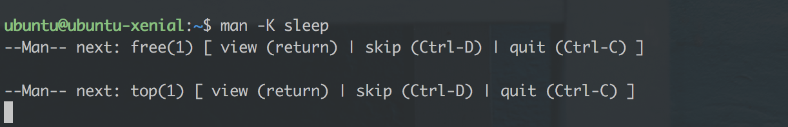

# Chapter 2 – Linux intro course

The second chapter of the course continues with the basics while starting a
foray into HTTP and TCP. At the end of this chapter should should be able to
create your own package, install it and verify that the contained service is up
and running.

## Agenda (replace for ToC)

 - Vim recap
 - Command flags – unix convention
 - More useful commands – touch, tail, less, mkdir, mv, cp, rm, rmdir
 - Folders and files – common locations
 - Linux file permissions
 - Adding/removing users from groups
 - stdin, stdout, stderr and file handles
The first chapter had a bit of a vim intro course, so we'll continue start by
doing a vim recap.

## Vim recap

Working with vim is primarily centered around remembering the *verbs*, *nouns*
and *modifiers*:

### Verbs

These are relevant for navigating around the *buffer* (i.e. the text you see in
your terminal).

 - `g` - go (`gg` to go to the top, `G` to the bottom)
 - `f` - find (`f;` to go to the semicolon)
 - `j` - down
 - `k` - up
 - `h` - left
 - `l` - right
 - `v` - visual
 - `d` - delete
 - `u` - undo
 - `y` - yank/copy

### Modifiers

The modifiers specify ranges – how large/small selection to create or what to
select.

 - `t` - to (`vt.` - visual to dot)
 - `a` - around
 - `i` - inside
 - `f` - find

### Nouns

 - `p` - paragraph
 - `w` - word (`ciw` is change inside word)
 - `b` - block

By combining the above you can become very efficient when navigating and
selecting text. You can try your new skills by adding a new binding to the Suave
example from the first chapter; add it to an IPv6 interface this time:
`IPAddress.Parse "::"`.

If you're interested in reading more about vim, [there][vim-1] [are][vim-2]
[numerous][vim-3] tutorials available online.

## Command flags

You've previously seen commands like [`chmod +x file.fsx`][chmod-1], [`ls
-lah`][explain-ls] and `tree -L 2`. There are a few conventions to the unix
command line that are beneficial to know about, as a lot of the unix command
line is built to be composable similar to PowerShell or how
Iteratee/seq/IEnumerable are composable.

Command flags start with a single dash `-` and then a character `h`, like so:
`ls -h` (list directory contents, print human bits/bytes), but they can also be
merged, like so `ls -lah`, which means to print all files, including symlinks
and dotfiles, in a long listing format; as well as human readable.

Alternatively, you can juxtapose the arguments with double dashes, like so: `ls
--all --human-readable -l`.

#### Man!

To see what command flags are available for a given command, you can use `man
<command name>`, like `man ls`. This displays a buffer that is paginated with
`less`, similar to how we paginated long `tree` outputs in the previous chapter.

You can also perform a brute-force search for a string in *all* man pages, by
passing the `-K <searchstring>` argument.

### More useful commands

You can create files, but how to manipulate directories, move files and copy
them? There are commands for most things:

 - `touch <filename>` – create a new file with the passed filename
 - `tail -f <filename>` – continuously print the tail of the file; useful for
   tailing logs
 - `less` – paginate output like we've done before
 - `mkdir -p ./path/to/dir` – create a new directory recursively, if it doesn't
   already exist
 - `mv <source file> <target file>` – move the source file to the target file
   location, or alternatively to a folder. If the target doesn't already exist
   then it's assumed to be a file name. If the target is a folder, then the file
   is copied to it and if the tagret is a file, the target file is overwritten.
 - `cp <source> <target>` – copy a file or directory
 - `rm <file>` – remove a file, or alternatively `rm -rf <dir>` to recursively
   remove a directory
 - `rmdir <dir>` specifically remove a directory if it's empty

Use your newfound skills to create the following tree:

    ubuntu@ubuntu-xenial:~$ tree
    .
    ├── a
    └── b
        ├── c
        │   └── d
        │       └── flag      (an empty file)
        ├── e
        └── f
            └── runner        (an empty file)

    6 directories, 2 files

How many commands did it take you to create this tree? I did it in three
commands. Can you do the same?

When you've successfully created the above, delete it all with a single command.

## Folders and files – common locations

Unix systems have a default folder layout. While the layouts differ slightly
between distros, there's a ["filesystem hierachy standard"][fhs] in place that
looks similar to this:

    .
    ├── bin – system binaries
    ├── sbin – system binaries
    ├── etc – configuration files
    ├── home – user home folders; not much used on servers
    ├── lib – shared libraries across the system
    ├── lib64 – similarly
    ├── tmp – temporary, world-readable, world-writable folder
    ├── opt – place your service's folder here: /opt/mysrv/{bin,public}
    ├── usr – most commands, man-docs and libraries from apt-get are installed here
    │   ├── bin – user (aka. the sys-admin's) commands
    │   ├── include – data used for linking executables
    │   ├── lib – libraries
    │   ├── local – similar for /opt; symlink from /opt/xyz, into here if needed
    │   ├── sbin – more commands
    │   ├── share – data and example configs
    │   └── src – used for source code for installed s/w
    └── var – if this server is stateful, put that state in here
        ├── lock -> /run/lock
        ├── log – logs from different services
        ├── lib – databases, storage
        └── run -> /run

When writing services for Linux, it's most common to have three or four
directories written. `/opt/mysrv/{bin,public}` for the binaries, `/etc/mysrv`
for the configuration and `/var/lib/mysrv` for any potential data. Finally, if
you want file logging, those go in `/var/log/mysrv`.

## Linux file and directory authorisation

Linux is built with *users* and *groups*, where a user can belong to one or many
groups but group cannot belong to other groups. They take the form of a bitmask
of nine bits:

    rwxr-xr-x haf developers
    ^^^ user bits
       ^^^ group bits
          ^^^ others bits

Furthermore, these permissions specify that `haf` is the owner of the file
(UID), that `developers` is the owning group (GID) and that anyone/others can
read and execute the file. A real-world example is `/bin/ls`.

    -rwxr-xr-x  1 root  wheel    38K Jul  9 05:03 /bin/ls

Which shows the owner to be `root`, the group to be `wheel` and allows every
user who has an account on the system to execute the file. That way, only the
system administrator is allowed to change the file.

The permissions are checked with an algorithm similar to:

    let check (op : Read|Write|Execute) =
      uid, gid = `whoami`
      if file.owner = uid then
        allowed op file.userPerms
      elif file.group = gid then
        allowed op file.groupPerms
      else
        allowed op file.otherPerms

– so it first checks to see if the user is the owner. Then checks the user's
group's permissions, then finally if none of those match, checks the permissions
for others. [More][file-perms-1] [reading][file-perms-2].

#### Changing permissions

You can change owning user, owning group and the respective flags with `chmod`
(change mode) and `chown` (change owner). Let's create a folder structure, user
and group for your own service `mysrv`.

    $ sudo su
    # mkdir -p /opt/mysrv/bin /opt/mysrv/public /etc/mysrv
    # addgroup --system mysrv
    Adding group `mysrv' (GID 117) ...
    Done.
    # adduser --system --no-create-home --home /opt/mysrv --shell /usr/sbin/nologin --group mysrv
    Adding system user `mysrv' (UID 112) ...
    Adding new user `mysrv' (UID 112) with group `mysrv' ...
    Not creating home directory `/opt/mysrv'.

You can now verify the properties of the user and the group with the following.

    # getent passwd mysrv
    mysrv:x:112:117::/opt/mysrv:/usr/sbin/nologin
    # id mysrv
    uid=112(mysrv) gid=117(mysrv) groups=117(mysrv)

`/usr/sbin/nologin` is used as a nice way to prohibit the service from spawning a
shell, when all it should do is to make a DB connection and serve some static
files.

#### File ACLs

You can use file ACLs if your file system gives a similar output as

    $ sudo tune2fs -l /dev/sda1 | grep 'Default mount'
    Default mount options:    user_xattr acl

The ACL flag is required for the file system to support it. Remember that
utilities like `mv` and `cp` may not preserve them. ACLs are normally not used;
even less so with the pattern VM/container-per-service which has a much stronger
separation of concerns. None the less, here's [a guide][acl-guide] on how to use
them, should you wish to separate responsibilities between users on your
servers.

## stdin (0), stdout (1) and stderr (2)

Standard-in, standard-out and standard-err are the methods by which your
programs can write to the terminal when running interactively, or write to the
log that comes *systemd*.

When processes communicate over pipes (`|`) they act on stdin and stdout. `a |
b` pipes a's stdout into b's stdin. For services, stderr is normally used for
logging errors and besides that all logs should be shipped to a central log
router or collector.

You can redirect these streams for commands you run. To quelch the output of
`ls`, you could run `ls >/dev/null` which snuffs the stdout output. Similarly
use `ls /non-existent 2>/dev/null` to redirect stderr to `/dev/null`.

These are called *file descriptors* in that they are the file descriptors always
opened for the process. Any other files that you [`open(2)`][open-2] are
numbered upwards. They are opaque handles which let user programs interface the
kernel's [io devices][ioctl].

In the next chapter we'll set up a Consul cluster to get better at using the
terminal to start and debug new services.

https://github.com/kelseyhightower/consul-on-kubernetes

 [vim-1]: https://yanpritzker.com/learn-to-speak-vim-verbs-nouns-and-modifiers-d7bfed1f6b2d#.ss7enj0qq
 [vim-2]: http://www.openvim.com/
 [vim-3]: https://danielmiessler.com/study/vim/
 [chmod-1]: http://explainshell.com/explain?cmd=chmod+%2Bx+file.ext
 [explain-ls]: http://explainshell.com/explain?cmd=ls+-lah+file.ext
 [fhs]: http://www.pathname.com/fhs/pub/fhs-2.3.html
 [file-perms-1]: https://unix.stackexchange.com/questions/134332/precedence-of-user-and-group-owner-in-file-permissions?rq=1
 [file-perms-2]: https://wiki.archlinux.org/index.php/File_permissions_and_attributes
 [acl-guide]: https://wiki.archlinux.org/index.php/Access_Control_Lists
 [open-2]: http://man7.org/linux/man-pages/man2/open.2.html
 [ioctl]: http://man7.org/linux/man-pages/man2/ioctl.2.html

