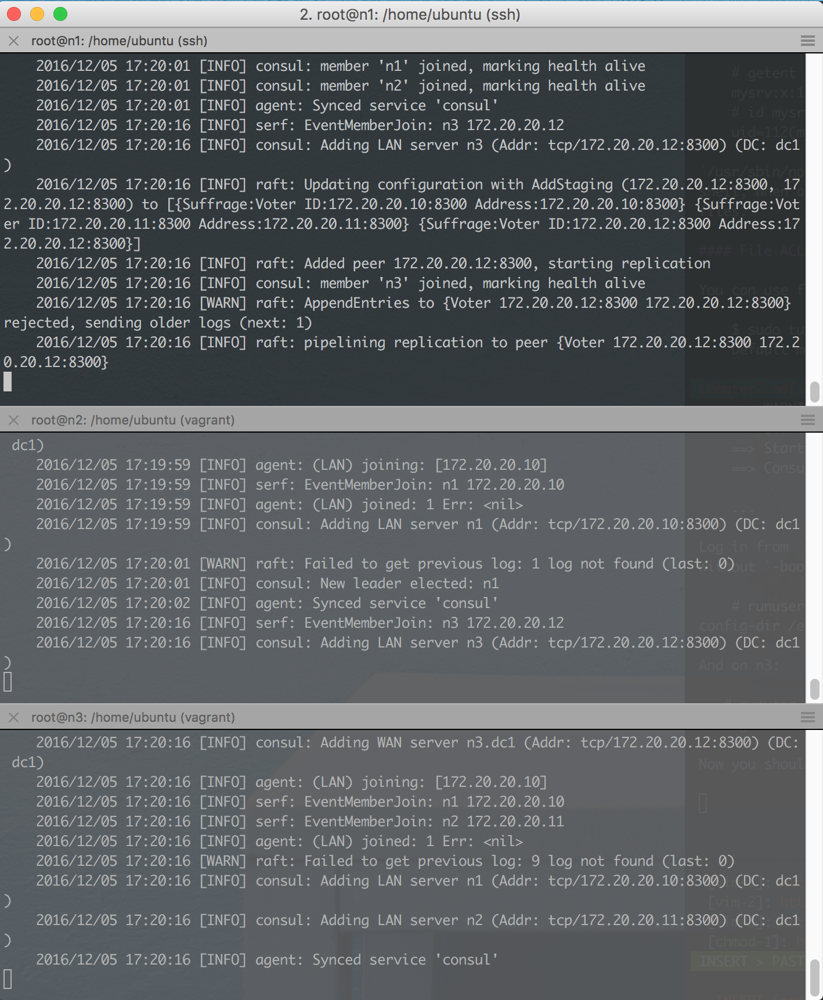
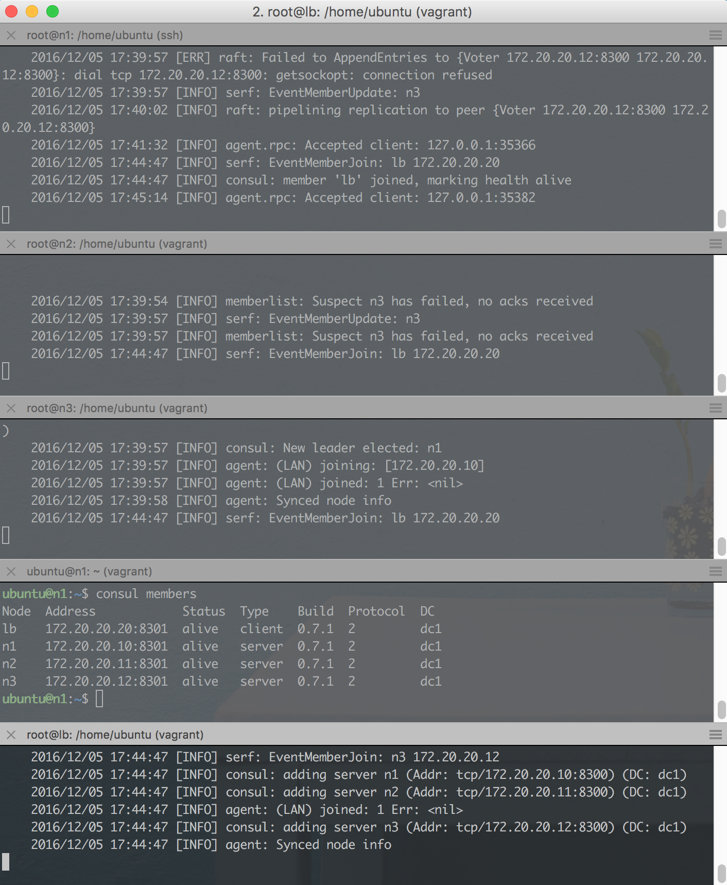

# Chapter 3 – Setting up service discovery

## ToC

* [Chapter 3 – Setting up service discovery](#chapter-3--setting-up-service-discovery)
  * [Spawning four nodes](#spawning-four-nodes)
  * [Run consul on a single node](#run-consul-on-a-single-node)
  * [Clustering consul](#clustering-consul)
  * [Set up consul client on the load balancer](#set-up-consul-client-on-the-load-balancer)
  * [Package Consul](#package-consul)
    * [Creating the \.service file](#creating-the-service-file)
    * [Packaging the \.deb package](#packaging-the-deb-package)
  * [What about security?](#what-about-security)

## Intro

Now that we know a bit more about how to work with files, where to place
configuration and databases, we'll try our hand at setting up a Consul cluster
manually. By doing so, we'll learn more about how to operate non-trivial
networked software and how to debug its setup. Consul, together with
[Fakta][fakta-gh] gives us the foundations for service discovery and external
(side-cart) health checks for our own networked services. It also lets us play
with DNS (over UDP) and TCP and work more with socket bindings.

The steps we're going to take are as follows:

 1. Spawning four nodes
   - 3 for our consul/mysrv cluster
   - 1 nginx load balancer
 1. Set up consul on a single node
 1. Validate setup on a single node
 1. Set up consul server on the three nodes
 1. Validate setup on three nodes
 1. Set up consul client on the fourth node; the load balancer
 1. Validate setup on the load balancer
 1. Set up mysrv on the three nodes with systemd
 1. (homework) Set up load balancing to the three nodes
 1. (homework) Validate load balancing with health checks is working

## Spawning four nodes

In this repository there's a directory called *chapter-03*. Destroy your current
VM and start vagrant from there.

    ✗ cd chapter-03
    ✗ vagrant up
    Bringing machine 'n1' up with 'virtualbox' provider...
    Bringing machine 'n2' up with 'virtualbox' provider...
    Bringing machine 'n3' up with 'virtualbox' provider...
    Bringing machine 'lb' up with 'virtualbox' provider...
    ==> n1: Importing base box 'ubuntu/xenial64'...
    ==> n1: Matching MAC address for NAT networking...
    ...

    ✗ vagrant status
    Current machine states:

    n1                        running (virtualbox)
    n2                        running (virtualbox)
    n3                        running (virtualbox)
    lb                        running (virtualbox)

## Run consul on a single node

    ✗ vagrant ssh n1
    $ consul agent -dev
    ==> Starting Consul agent...
    ==> Starting Consul agent RPC...
    ==> Consul agent running!
               Version: 'v0.7.1'
             Node name: 'n1'
            Datacenter: 'dc1'
                Server: true (bootstrap: false)
           Client Addr: 127.0.0.1 (HTTP: 8500, HTTPS: -1, DNS: 8600, RPC: 8400)
          Cluster Addr: 127.0.0.1 (LAN: 8301, WAN: 8302)
        Gossip encrypt: false, RPC-TLS: false, TLS-Incoming: false
                 Atlas: <disabled>

    ==> Log data will now stream in as it occurs:
    ...

Seems to be working! Consul magically exists, because of a so called
*provisioning* script in the Vagrantfile that downloads and copies the `consul`
binary to /usr/bin/.

Let's SSH to validate that consul is up and running.

    ✗ vagrant ssh n1
    $ curl http://127.0.0.1:8500/ -i
    HTTP/1.1 301 Moved Permanently
    Location: /ui/
    Date: Mon, 05 Dec 2016 16:53:30 GMT
    Content-Length: 39
    Content-Type: text/html; charset=utf-8

    <a href="/ui/">Moved Permanently</a>.

Looking good. Now, let's cluster it!

## Clustering consul

Consul nodes can work both as server nodes and client nodes. The server nodes
should be an uneven number of nodes larger than three, with mutual connectivity.
The rest of your computers can run consul in client mode: aim for a ratio of,
say, 1:10 of server-to-client nodes.

We'll start by pinging `n2` and `n3` from `n1`, to verify connectivity.

    ubuntu@n1:~$ ping 172.20.20.11
    PING 172.20.20.11 (172.20.20.11) 56(84) bytes of data.
    64 bytes from 172.20.20.11: icmp_seq=1 ttl=64 time=0.542 ms
    64 bytes from 172.20.20.11: icmp_seq=2 ttl=64 time=0.329 ms
    ^C
    --- 172.20.20.11 ping statistics ---
    2 packets transmitted, 2 received, 0% packet loss, time 999ms
    rtt min/avg/max/mdev = 0.329/0.435/0.542/0.108 ms
    ubuntu@n1:~$ ping 172.20.20.12
    PING 172.20.20.12 (172.20.20.12) 56(84) bytes of data.
    64 bytes from 172.20.20.12: icmp_seq=1 ttl=64 time=0.575 ms
    ^C
    --- 172.20.20.12 ping statistics ---
    1 packets transmitted, 1 received, 0% packet loss, time 0ms
    rtt min/avg/max/mdev = 0.575/0.575/0.575/0.000 ms

That looks good. Let's shut down the dev consul instance and re-launch it like
this – we'll have a terminal up for every node in the cluster. Note that consul
deviates from the standards for command-line flags that we just learnt and only
has a single dash.

We'll also use `runuser` to execute as the consul user. Run the following **as
root**:

    mkdir -p /var/lib/consul /usr/local/bin /etc/consul.d
    addgroup --system consul
    adduser --system --no-create-home --home /var/lib/consul --shell /usr/sbin/nologin --group consul
    chown -R consul:consul /var/lib/consul
    runuser -l consul -c 'consul agent -server -bootstrap-expect=3 -data-dir=/var/lib/consul -bind 172.20.20.10 -config-dir /etc/consul.d'

The last line will output:

    This account is currently not available.

When testing we need to bind a shell to the execution of the service; so for
now, let's change the user's shell to point to bash, and retry.

    # usermod -s /bin/bash consul
    # runuser -l consul -c 'consul agent -server -bootstrap-expect=3 -data-dir=/var/lib/consul -bind 172.20.20.10 -config-dir /etc/consul.d'
    ==> WARNING: Expect Mode enabled, expecting 3 servers
    ==> Starting Consul agent...
    ==> Starting Consul agent RPC...
    ==> Consul agent running!
               Version: 'v0.7.1'
    ...

Log in from `n2` and `n3` and join them to the cluster by running the above
without `-boostrap-expect` but instead with `-join`:

    # runuser -l consul -c 'consul agent -server -join 172.20.20.10 -data-dir=/var/lib/consul -bind 172.20.20.11 -config-dir /etc/consul.d'

And on n3:

    # runuser -l consul -c 'consul agent -server -join 172.20.20.10 -data-dir=/var/lib/consul -bind 172.20.20.12 -config-dir /etc/consul.d'

Now you should have three terminals looking like this.

You can start a fourth terminal and run

    $ consul members
    Node  Address            Status  Type    Build  Protocol  DC
    n1    172.20.20.10:8301  alive   server  0.7.1  2         dc1
    n2    172.20.20.11:8301  alive   server  0.7.1  2         dc1
    n3    172.20.20.12:8301  alive   server  0.7.1  2         dc1

To ensure that all members are alive and kicking. Let's also test node discovery
from `n1`:

    $ dig +short @127.0.0.1 -p 8600 n2.node.consul
    172.20.20.11

You can also try to terminate one of the server – the cluster should remain
running and should still respond to queries. Remember to start the server again
once you're done.

## Set up consul client on the load balancer

First create the user, group and folders, like for the other consul **server**s.
However, this time, the consul agent should be run in **client** mode.

    # runuser -l consul -c 'consul agent -join 172.20.20.10 -data-dir=/var/lib/consul -bind 172.20.20.20 -config-dir /etc/consul.d'

This time around, on n1:

    $ consul members
    Node  Address            Status  Type    Build  Protocol  DC
    lb    172.20.20.20:8301  alive   client  0.7.1  2         dc1
    n1    172.20.20.10:8301  alive   server  0.7.1  2         dc1
    n2    172.20.20.11:8301  alive   server  0.7.1  2         dc1
    n3    172.20.20.12:8301  alive   server  0.7.1  2         dc1

## Package Consul

With Consul running, let's ensure we have a repeatable environment by packaging
consul as a .deb package. We'll set it up to use the existing directories as
used in the previous sections.

Building a package for linux used to be a very annoying process until *fpm* came
along. It stands for "effing package management" and is a way to easily package
a set of files.

    sudo update-alternatives --set editor /usr/bin/vim.basic
    sudo apt-get install ruby ruby-dev build-essential curl -y
    sudo gem install fpm --no-ri
    mkdir ~/pkg && cd ~/pkg
    mkdir -p ./usr/local/bin ./usr/lib/systemd/system ./etc/consul.d/{server,client,bootstrap}
    touch ./etc/consul.d/bootstrap/consul.conf
    touch ./etc/consul.d/server/consul.conf
    curl -LO https://releases.hashicorp.com/consul/0.7.2/consul_0.7.2_linux_amd64.zip
    sha256sum consul_0.7.2_linux_amd64.zip
    # check its output now against https://releases.hashicorp.com/consul/0.7.2/consul_0.7.2_SHA256SUMS
    unzip consul_0.7.2_linux_amd64.zip && rm consul_0.7.2_linux_amd64.zip
    mv consul ./usr/local/bin/

### Creating the .service file

The .service file is responsible for starting consul when the operating system
starts. It works primarily in `/usr/lib/systemd/system` (note the double
`system` substring) and in `/etc/systemd/system`. File in the former (ending in
`.service`) are symlinked to the latter when you run `systemctl enable ...`.

    cat <<EOF >./usr/lib/systemd/system/consul.service
    [Unit]
    Description=Consul server
    Wants=network-online.target
    After=network-online.target

    [Service]
    Type=simple
    Restart=on-failure
    RestartSec=10
    User=consul
    Group=consul
    LimitNOFILE=64000

    ExecStart=/usr/local/bin/consul

    [Install]
    WantedBy=multi-user.target
    EOF

    cat <<EOF >./pre-install
    #!/bin/sh
    set -e
    user="consul"
    group="consul"
    datadir="/var/lib/consul"
    confdir="/etc/consul.d"

    if ! getent group "$group" > /dev/null 2>&1 ; then
      addgroup --system "$group" --quiet
    fi

    if ! id "$user" > /dev/null 2>&1 ; then
      adduser --system --home "$datadir" --no-create-home \
        --ingroup "$group" --disabled-password \
        --gecos "Consul server or client" \
        --shell /bin/false --quiet "$user"
    fi

    chown -R consul:consul /etc/consul.d /var/lib/consul

    exit 0
    EOF

    cat <<EOF >./post-install
    #!/bin/sh
    set -e
    echo "To run: 'sudo systemctl daemon-reload'"
    echo "To run: 'sudo systemctl enable consul'"
    EOF

    cat <<EOF >./pre-uninstall
    #!/bin/sh
    set -e
    systemctl --no-reload stop consul.service >/dev/null 2>&1 || true
    systemctl disable consul >/dev/null 2>&1 || true
    EOF

As a final touch, fill out the [configuration][consul-conf-docs] in the .conf
files that were created. To boostrap in `./etc/consul.d/bootstrap/consul.conf`:

    export CONSUL_KEY="$(consul keygen)"

The key is used for the configuration files.

    cat <<EOF >./etc/consul.d/bootstrap/consul.conf
    {
      "bootstrap": true,
      "server": true,
      "datacenter": "dc1",
      "data_dir": "/var/lib/consul",
      "encrypt": "$CONSUL_KEY"
    }

Then fill out the server and clients, too:

    cat <<EOF >./etc/consul.d/server/consul.conf
    {
      "server": true,
      "datacenter": "dc1",
      "data_dir": "/var/lib/consul",
      "encrypt": "$CONSUL_KEY",
      "start_join": ["172.20.20.11", "172.20.20.12"]
    }

    cat <<EOF >./etc/consul.d/client/consul.conf
    {
      "server": false,
      "datacenter": "dc1",
      "data_dir": "/var/lib/consul",
      "encrypt": "$CONSUL_KEY",
      "start_join": ["172.20.20.10", "172.20.20.11", "172.20.20.12"]
    }

If you happen to have static IPs in your production environment, this will be
enough. In fact, since Consul works well for service discovery, having specific
IPs for Consul may be a good trade-off, as long as you discover all other
services through consul.

### Packaging the `.deb` package

    fpm --name consul --input-type dir --output-type deb --version 0.7.2 --vendor haf --pre-install ./pre-install --post-install ./post-install --pre-uninstall ./pre-uninstall --iteration 1 .
    dpkg-deb -c consul_0.7.2-1_amd64.deb

You can now try your installation:

    sudo systemctl daemon-reload
    sudo systemctl enable consul
    sudo systemctl start consul && journalctl -fu consul -l

Make note that:

 - Services that bind to network interfaces should *not* be started by default,
   because they may cause security vulnerabilities unless set up properly.
 - You need to do `daemon-reload` for systemd to discover its new unit file.
 - The file ends with `.service` but is called a unit-file. The unit file
   schedules the service to be run.
 - There [exists a lot of documentation][systemd-rhel] for systemd.
 - You may successfully start a service with `systemctl start consul` but that
   doesn't mean it starts automatically the next boot.

If you have a look at the output of listing the symlink, it should look like
this:

    $ ls -lah /etc/systemd/system/multi-user.target.wants/consul.service
    lrwxrwxrwx 1 root root 38 Jan  1 17:48 /etc/systemd/system/multi-user.target.wants/consul.service -> /usr/lib/systemd/system/consul.service

## What about security?

In the above tutorial the person provisioning the cluster as well as anyone with
access to the provisioning scripts can intercept and interfere with production.
Let's analyse the situation:

 - There's no firewall, so any other node in the LAN could connect to Consul and
   exfiltrate all its data.
 - We're only encrypting the gossip with a symmetric key; there's no encryption
   for data in rest or data in transit for e.g. the key-value store or any of
   the other services provided by consul.
 - A malicious insider could read the keys from source control and use that to
   disrupt the cluster's gossip.
 - Similarly he/she could connect to Consul and read/write any data, including
   intercepting service discovery to perform man-in-the-middle attacks.
 - We're yet to set up TLS encryption between consul nodes.
 - We haven't in any way hardened our operating system; we're not shipping its
   logs and we're not using AppArmour.
 - We've made Consul start in its own group and with its own user.
 - We've made the Consul set up repeatable.

As you can see, there's a lot to think about; no wonder that being a sysadmin is
a full time-job. However, this tutorial is for working programmers, so we're
going to the sharpest sword that we have; abstraction.

It's a double-edged one, though. We've gone through a few layers already:

 - From dev laptop to VM
 - From running commands in SSH to running them through the Vagrantfile's
   provisioning support
 - From downloading and unzipping manually to packaging our software
 - Going forward, using Consul means we're abstracting from IPs to service
   discovery.

We've also experienced a lot of friction; everything has to be manually typed
(of course it's still a magnitude fast than clicking 'the same way' through a
user interface). When things fail, you have to remember where stdout, stderr and
syslog are.

So what more levels are there? In the next chapter we'll go through these
abstraction layers:

 - From manually assigning IPs to letting the infrastructure assign IPs.
 - From specifying binding NICs to specifying ports that are published from the
   service on "some node's IP" (aka a "pod").
 - The service-discovery mentioned above.
 - From dealing with firewalls manually to letting the infrastructure handle
   them.
 - From manually generating passwords (like `consul keygen`) in order to save it
   in source control for bootstrapping nodes, to saving it in a Secret-store.

Until next time.

 [fakta-gh]: https://github.com/logibit/Fakta
 [systemd-rhel]: https://access.redhat.com/documentation/en-US/Red_Hat_Enterprise_Linux/7/html/System_Administrators_Guide/sect-Managing_Services_with_systemd-Unit_Files.html
 [consul-conf-docs]: https://www.consul.io/docs/agent/options.html
