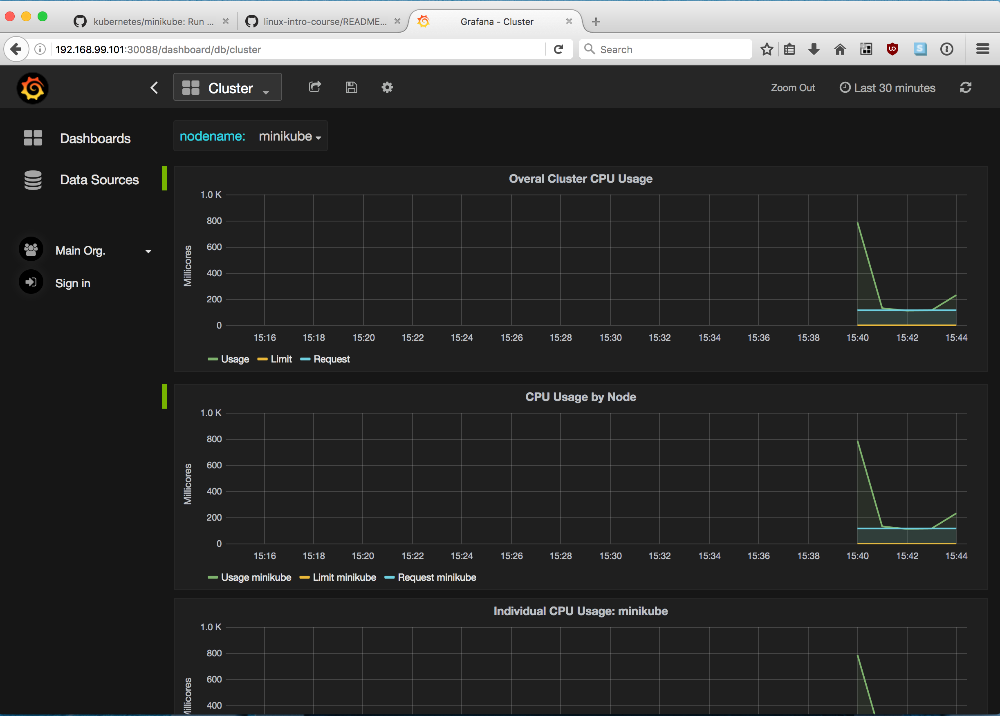
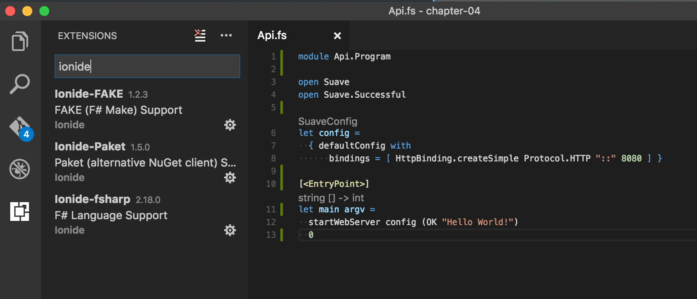
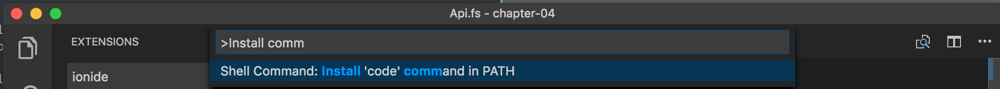
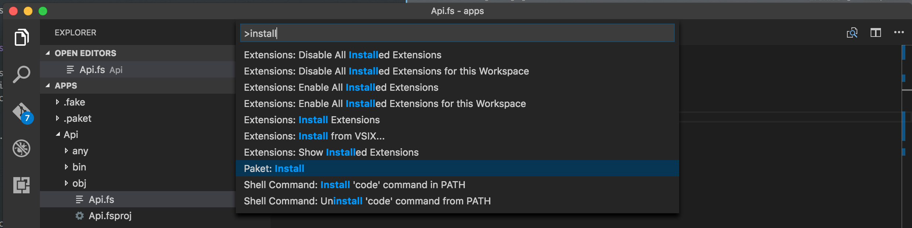

# Chapter 4 – Leap-frogging infrastructure development

In the previous chapters, we've gone from learning what a terminal is, to being
able to set up and debug a semi-production worthy consul cluster, packaged with
`.deb`-files.

Every service you create would have to be similarly treated – pre-install,
post-install, pre-uninstall scripts, start-up scripts, `/etc/default/consul`
environment variables, firewalling, build-scripts, packaging of the above and
then modifying them all depending on your deployment environment.

In this chapter I'll show you how you can go the next step with micro-services
in F# on Linux. This is because on top of the above fiddling per-service, we
also need:

 - Logging
   * From kernel/firewall for intrusion detection and health checks
   * From auditd for commands being run
   * From systemd for start-and-stop of services, exit codes, etc
   * From your apps
   * From your load-balancer
   * From any infrastructure components you have
 - Metrics
   * From all of the above
 - Load-balancing
 - Service discovery (where is 'web', what nodes are 'web'?)
 - Horisontal scaling – bring up more nodes when needed
 - Scaling down again – when load stops peaking
 - Rolling deploys – a new version of your service should be 'eased' into load
 - Firewalling
 - Users/groups between APIs – we've only touched upon users/groups inside a
   single operating system
 - Running commands on *all* nodes in your production
 - Managing networking – need a switch? A bridge between two VLANs?
 - Managing external storage – need to add disk in a VM?
 - Failover & Health checks – when things go down and reacting on it

## Agenda

In this chapter you'll get to understand [Kubernetes][kube] and 1) how to deploy
services for a subset of the above bullet points, and 2) how to let your own
stateless and [stateful][k-blog-ss] service make use of as much as possible of the above.

<blockquote>Kubernetes is an open-source system for automating deployment,
scaling, and management of containerized applications.</blockquote>

We'll deploy these services with a few commands:

 1. Hashicorp Consul & Consul UI
 1. Apache ZooKeeper
 1. Apache Kafka
 1. A F# service with Suave and Logary writing to Kafka
 1. A F# service with Suave and Logary reading from Kafka
 1. A schema registry
 1. PostgreSQL
 1. EventStore
 1. Elastic's ElasticSearch & Kibana
 1. InfluxData's InfluxDB & Grafana
 1. Apache Flink
 1. Prometheus

Once the initial setup is done, we'll also deploy these operators:

 1. A backup operator for ZooKeeper
 1. A backup operator for Kafka
 1. A backup operator for ElasticSearch
 1. A backup operator for InfluxDB
 1. A backup operator for PostgreSQL

## A primer on Kubernetes

Kubernetes is a cloud-orchestration platform run by the Linux Foundation, the
same organisation officially in charge of shepherding Linux, the operating
system. It solves a lot of the thorny issues of configuration management and
operations that would otherwise have to be solved by each company by itself.

### Alternative to...

If you'd not discovered Kubernetes through e.g. this guide, your path to what it
offers would probably look something like:

 1. Manually managing your server like in chapter 1-3.
 2. Discovering configuration management and,
   1. using it to *install* everything as well as,
   1. using it to *configure* one-shot configurations.
 3. Noticing you need something that *coordinates* deployments, manages service
    metadata, versions, tenancy. Create a CMDB
 4. Write custom micro-services for each use case: { rolling deployments,
    backups, service metadata-discovery, ... }
 5. Look around for something more "off the shelf" and then discovery
    Kubernetes.

### Concepts

When deploying services, you'll recall from previous chapter that a service
binds to an IP and a Port; in conjunction called an Endpoint. Ports are only
possible to bind for a single service at a time, so they are a scarce resource.

Kubernetes sets up networking so that each 'node' is run on top of an overlay
network, with a unique IP. Specifically a docker-container in the default case.
This node is called a 'pod' in Kubernetes vocabulary. Via docker(-like)
virtualisation, many 'pods' can run in a single VM/machine/node, all coordinates
via the 'kubectl' daemon.


These pods are then linked with the overlay network software called OpenVSwitch.


This sort of setup removes a lot of the hindrances you'd not discover until
your development organisation had grown to a certain complexity requirement.
For example, if you need to bridge on-site local GPU resources with cloud
services, OVS would give you a way out.

### Why did I just learn linux then?

You need to understand that everything in this eco-system is built around Linux,
and you need Linux skills both to administrate it and to run services on top of
it; the containers you'll run your services in, are actually small linux
distributions but running on top of the host's kernel.

Software running in containers also needs to be secured like described in the
previous chapters – a container does perform a bit of isolation, but it's not at
the same level of a VM on top of a Hypervisor. For example, by default a
Dockerfile runs your software as `root`, but that still gives you access to the
devices and some modules of the kernel which aren't namespaced. So create an
app-user.

## Starting Minikube

The first step is to create a local Kubernetes cluster to play around with. To
accomplish this, install [minikube][minikube-qs] (assuming you have 16 GiB
memory and 8 cores):

    minikube start  --memory 8192 --cpus 4
    kubectl run hello-minikube --image=gcr.io/google_containers/echoserver:1.4 --port=8080
    kubectl expose deployment hello-minikube --type=NodePort
    kubectl get pod
    curl $(minikube service hello-minikube --url) -i

On top of that, let's also add the "Heapster" addon to Kubernetes, in order to
monitor our deployment with Grafana and Influx.

    minikube addons enable heapster
    minikube addons open heapster



Let's get Consul up and running now that we have some basic monitoring support.

## Starting a Consul cluster

In this folder, you'll find a number of `.yml` files that specify how Consul is
deployed.

### Concepts

We'll be using these concepts:

 - [Pod][kube-pod] – a *node* with an assigned IP and a *grouping* of
   containers. A *logical host*, from an application perspective.
 - [Service][kube-svc] – *logically* specifies **ports** for a named *service*.
   Combined with the **Pod's** IP address, we have an endpoint that we can
   connect to. One could say that Service gives a policy for which a Pod is
   accessed.
 - [Endpoint][kube-ep] – *implicit* configuration item created by the Kubernetes
   infrastructure, by `POST`-ing to the corresponding Service REST-resource;
   which associates the POST-ed IPs with the Service's logical name.
 - [StatefulSet][kube-ss] – configuration for **stable, unique** network
   identifiers and persistent storage. Will be used for bootstrapping Consul.
 - [Secret][kube-secret] – a location for storing sensitive data in the
   Kubernetes cluster.
 - [ConfigMap][kube-configmap] – decouples images from their configurations,
   letting Kubernetes/infrastructure provide configuration at runtime rather
   than "hard-coding" it in an image.

### Prerequisites

You also need [cfssl][cfssl] and cfssljson to run. On OS X you can
install them like so.

    brew install cfssl consul

### Creating a Certificate Authority (CA)

In order to secure communication between Consul nodes, we'll need a CA. In the
`./ca` folder, I've prepared *Certificate Signing Requests* for creating both
the authority and consul-specific certificates.

    cfssl gencert -initca ca/ca-csr.json | cfssljson -bare ca

You should now have these files in your directory:

    README.md      ca-key.pem     ca.pem         consul.csr     imgs
    ca             ca.csr         consul-key.pem consul.pem     services

### Creating a gossip encryption key

We need to generate a new gossip key again. Remember from Chapter 3, that this
key was used for symmetric encryption of gossip data between consul nodes.

    GOSSIP_ENCRYPTION_KEY=$(consul keygen)

This value is now available in your shell to inspect.

    echo $GOSSIP_ENCRYPTION_KEY

### Saving the secrets to Kubernetes

Let's save the generated secrets/files into a Secret named `consul` in
Kubernetes.

    kubectl create secret generic consul \
      --from-literal="gossip-encryption-key=${GOSSIP_ENCRYPTION_KEY}" \
      --from-file=ca.pem \
      --from-file=consul.pem \
      --from-file=consul-key.pem

Validate it's been saved with:

    $ kubectl get secret consul
    NAME      TYPE      DATA      AGE
    consul    Opaque    4         1m

### Saving Consul's server configuration to Kubernetes

With the secrets properly saved, let's save Consul's own configuration file to a
[ConfigMap][kube-configmap]:

    kubectl create configmap consul --from-file=configs/server.json

If you look inside `server.json`, you'll find a normal Consul server config. By
default consul will run in server mode and *not* bootstrapped. The settings in
`server.json` are there to tell Consul to validate its TLS certificates used for
encryption both on incoming and outgoing TLS connections.

### Creating a new Service

The file `./services/consul.yml` lets you expose Consul internally in the
cluster to each other. Note the named ports which can be used by their names
when you specify connectivity between services in the future.

    $ kubectl create -f services/consul.yml
    service "consul" created

This creates the metadata for the service, but doesn't schedule it in a pod.
Yet.

With the service created, give it its configuration, check that three pods are
created an in the *Running* state and that they aren't yet joined to a cluster:

    $ kubectl create -f statefulsets/consul.yml
    $ kubectl get pods
    NAME                              READY     STATUS    RESTARTS   AGE
    consul-0                          1/1       Running   0          5s
    consul-1                          1/1       Running   0          22s
    consul-2                          1/1       Running   0          17s
    hello-minikube-3015430129-85prd   1/1       Running   0          1h
    $ kubectl logs consul-0
    ...
    2017/01/02 16:18:35 [ERR] agent: coordinate update error: No cluster leader

### Creating a new StatefulSet

First, let's have a look at the [design motifs][kube-ssdm] of StatefulSets:

 - Data per instance which should not be lost even if the pod is deleted,
   typically on a persistent volume
   - Some cluster instances may have tens of TB of stored data - forcing new
     instances to replicate data from other members over the network is onerous
 - A stable and unique identity associated with that instance of the storage -
   such as a unique member id
 - A consistent network identity that allows other members to locate the
   instance even if the pod is deleted
 - A predictable number of instances to ensure that systems can form a quorum
   - This may be necessary during initialization
 - Ability to migrate from node to node with stable network identity (DNS name)
 - The ability to scale up in a controlled fashion, but are very rarely scaled
   down without human intervention

Bootstrapping a consul cluster matches all of these requirements. We have a
service "consul" that needs a stable number of nodes – instances of the running
server.

Let's go through the StatefulSet and see what's in it. The configuration names
the StatefulSet instance.

    apiVersion: apps/v1beta1
      kind: StatefulSet
        metadata:
          name: consul

The yml file continues with mapping a Service to create replicas of. The replica
is named `$serviceName-$replica`.

    spec:
      serviceName: consul
      replicas: 3

The `template` specifies how the Pod should be created. Instances of Pods based
on this template are created, but with unique identities.

      template:
        metadata:
          labels:
            app: consul
        spec:
          terminationGracePeriodSeconds: 10
          securityContext:
            fsGroup: 1000

The rest of the spec follows [v1.PodSpec][kube-podspec].

          containers:
            - name: consul
              image: "consul:0.7.2"
              env:
                - name: POD_IP
                  valueFrom:
                    fieldRef:
                      fieldPath: status.podIP
                - name: GOSSIP_ENCRYPTION_KEY
                  valueFrom:
                    secretKeyRef:
                      name: consul
                      key: gossip-encryption-key
              args:
                - "agent"
                - "-advertise=$(POD_IP)"
                - "-bind=0.0.0.0"
                - "-bootstrap-expect=3"
                - "-client=0.0.0.0"
                - "-config-file=/etc/consul/server.json"
                - "-datacenter=dc1"
                - "-data-dir=/consul/data"
                - "-domain=cluster.local"
                - "-encrypt=$(GOSSIP_ENCRYPTION_KEY)"
                - "-server"
                - "-ui"

The volume mounts are passed to the docker daemon. In this case, the docker
daemon mounts the folder `/consul/data` and we name the volume `data` in
Kubernetes.

              volumeMounts:
                - name: data
                  mountPath: /consul/data

These will be mapped to the ConfigMap `consul`, and Secret `consul` that we
created before.

                - name: config
                  mountPath: /etc/consul
                - name: tls
                  mountPath: /etc/tls

These ports match the ports specified in the Service `consul`.

              ports:
                - containerPort: 8500
                  name: ui-port
                - containerPort: 8400
                  name: alt-port
                - containerPort: 53
                  name: udp-port
                - containerPort: 8443
                  name: https-port
                - containerPort: 8080
                  name: http-port
                - containerPort: 8301
                  name: serflan
                - containerPort: 8302
                  name: serfwan
                - containerPort: 8600
                  name: consuldns
                - containerPort: 8300
                  name: server

The volume element is a sibling to `containers` above and specifies how volumes
should be mapped to the running container.

          volumes:
            - name: config
              configMap:
                name: consul
            - name: tls
              secret:
                secretName: consul

The `volumeClaimTemplates` node is a sibling to the `template` node. Each
template instantiation maintains its mapping to the above created Pod instance.
It must create an instance with a name matching one of the `volumeMounts` in the
Pod template above. It takes precedence over any volumes in the template above.

In this case the volumes `config` and `tls` are created for each container and
auto-mounted to a `configMap` and `secretName`, respectively, whilst this spec
creates the persistent storage that a consul node needs.

      volumeClaimTemplates:
        - metadata:
            name: data
            annotations:
              volume.alpha.kubernetes.io/storage-class: anything
          spec:
            accessModes:
              - ReadWriteOnce
            resources:
              requests:
                storage: 10Gi

Let's create the StatefulSet.

    kubectl create -f statefulsets/consul.yml

And verify that it was successfully created.

    $ kubectl get statefulset
    NAME      DESIRED   CURRENT   AGE
    consul    3         3         30m

### A Job to join the nodes

Contrary to passing `-join` to consul nodes `n2`, `n3`, like we did in the
previous chapter, this time we're using the `consul` binary to tell the process
about its sibling servers.

We'll only ever run this job once per cluster initialisation. Because jobs
"execute containers", this job will spawn a new consul container with custom
parameters: `-rpc-addr=consul-0.consul.$(NAMESPACE).svc.cluster.local:8400`.

    kubectl create -f jobs/consul-join.yml

Again, we verify that it ran OK.

    $ kubectl get jobs
    NAME          DESIRED   SUCCESSFUL   AGE
    consul-join   1         1            29s

### Talking to the cluster

Let's verify that Consul's nodes have started successfully.

    $ kubectl port-forward consul-0 8400:8400
    Forwarding from 127.0.0.1:8400 -> 8400
    Forwarding from [::1]:8400 -> 8400

Then in another terminal, run.

    $ consul members
    Node      Address          Status  Type    Build  Protocol  DC
    consul-0  172.17.0.7:8301  alive   server  0.7.2  2         dc1
    consul-1  172.17.0.8:8301  alive   server  0.7.2  2         dc1
    consul-2  172.17.0.9:8301  alive   server  0.7.2  2         dc1

Let's also check the Web UI.

    $  kubectl port-forward consul-0 8500:8500
    Forwarding from 127.0.0.1:8500 -> 8500
    Forwarding from [::1]:8500 -> 8500

Then in another terminal, run this to start your browser.

    $ open http://127.0.0.1:8500

### Testing failure

Consul is built to support failure of nodes. Because it's a persistent service,
it will rely on its persistent-volume backed state on resumption from a crash.
The StatefulSet will ensure that there are always three pods running. This means
that you can delete pods freely. In one terminal, let's tail the log of
consul-1, while deleting the pod for consul-2.

    $ kubectl tail -f consul-1

Then in another terminal:

    $ kubectl tail -f consul-2

Observe how the pods (`kubectl get pods` are restarted and a quorum is resumed
via the logs).

## F# service writing to Kafka

With Consul set up and the foundations of Kubernetes well learnt, we'll start
writing some code of our own. We'd like to create a web service that responds
with its version, is stateless and horisontally scalable and is capable of
placing messages on a Kafka topic (using the default partitioner).

To bootstrap the projects, we'll use a project called [Forge][forge-readme].
Start by installing it.

[Linux][linuxbrew]: `brew tap samritchie/forge && brew install forge`, OS
X/[macOS][homebrew]: `brew tap samritchie/forge && brew install forge` and on
[Windows][scoop]: `scoop install forge`. Unfortunately, at the time of writing I
haven't been able to find a HTTP link to the different package managers, to
share.

### Creating a new web project

Start by removing the finished solutions from `./chapter-04/apps` and then
create a new [suave][suave] project; it will be our main point of interaction.

    $ forge new project --name Api --folder . --template suave
    Generating project...
    ...

Note the lower-case template name and the uppercase "Api" name. Now let's build
the project, to be able to run it, and change to a prerelease version of Suave
to get the latest goodness.

    $ chmod +x build.sh && ./build.sh && ./build.sh
    ...
    Finished Target: Build
    ...
    Total:     00:00:02.7263792
    Status:    Ok
    ---------------------------------------------------------------------
    $ tree ./build
    build
    ├── Api.exe
    ├── Api.exe.mdb
    ├── FSharp.Core.dll
    └── Suave.dll

    0 directories, 4 files

The first build downloads all packages, the second time it actually builds the
program.

### Running the program

Now, make your App.fs file look like this:

```fsharp
module Api.Program

open Suave
open Suave.Successful

let config =
  { defaultConfig with
      bindings = [ HttpBinding.createSimple Protocol.HTTP "::" 8080 ] }

[<EntryPoint>]
let main argv =
  startWebServer config (OK "Hello World!")
  0
```

Then run `./build.sh` again. You can now start the API.

    $ mono build/Api.exe
    [14:20:35 INF] Smooth! Suave listener started in 106.655 with binding :::8080

In a different terminal, curl the API.

    $ curl 'http://[::]:8080' -i
    HTTP/1.1 200 OK
    Server: Suave (https://suave.io)
    Date: Tue, 03 Jan 2017 13:24:07 GMT
    Content-Type: text/html
    Content-Length: 12

    Hello World!

### Viewing in VSCode

Writing a statically typed language without an editor can gives you hints is
like love without kisses. So let's install VSCode and ionide.

    brew cask install visual-studio-code

Or by surfing to [its homepage][vscode]. Proceed to install the [Ionide
extension][ionide] (all of them). It will give you code-completion and label the
code as you type.



If you installed VSCode via a click-click installer, you can add the `code`
binary to your path by pressing `CMD+P`, like so:



### Adding tests

We'll add some test stubs as well. These will be used to test our code and API
in the future. In the `apps` folder, run:

    $ forge new project --name Api.Tests --folder . --template expecto
    Generating project...
    ...
    /Users/h/dev/lynx/linux-intro/chapter-04/apps/paket.dependencies contains
    package FAKE in group Main already.
    0 seconds - ready.
    Done!
    $ xbuild Api.Tests/Api.Tests.fsproj && mono --debug Api.Tests/bin/Debug/Api.Tests.exe
    [16:34:55 INF] EXPECTO? Running tests...
    [16:34:55 ERR] samples/should fail failed in 00:00:00.0003260.
    I should fail because the subject is false.
    [16:34:55 INF] EXPECTO! 2 tests run in 00:00:00.0360801 – 1 passed, 0 ignored, 1 failed, 0 errored. ( ರ Ĺ̯ ರೃ )

### Creating a container

Kubernetes uses a *runtime*; either *docker* or *rkt* (pronounced [ˈrɒkɪt]) for
packaging and running software. Kubernetes has API adapters for them both. As
such, we should build *an image* that can be started as a *container* on Docker.

We'll need to copy the binaries into the image and then run them with Mono. When
you've compiled once (like above with `xbuild`), create the following
`Dockerfile` next to the `Api` and `Api.Tests` folders.

    FROM fsharp:latest

    EXPOSE 8080
    COPY build /app
    CMD mono /app/Api.exe

In order to build the image and also have that image accessible to Kubernetes,
set the environment variables for the *minikube* docker host. By running `docker
version` you validate that the docker client has access to the host.

    $ eval $(minikube docker-env)
    $ docker version
    Client:
     Version:      1.12.0
    ...
    Server:
     Version:      1.11.1
    ...

Now, let's build the container to be named `api` and have tag `v1`.

    $ docker build --tag api:v1 .
    Sending build context to Docker daemon 474.1 MB
    Step 1 : FROM fsharp:latest
    latest: Pulling from library/fsharp
    16da43b30d89: Pull complete
    ...
    Successfully built 83687f974734

### Running the container

The container should be run in interactive mode `-i`, with the
stdin/stdout/stderr attached to your terminal `-t`, be removed when you send it
SIGINT `--rm`:

    $ docker run --rm -it api:v1
    [15:54:20 INF] Smooth! Suave listener started in 84.895 with binding :::8080

Press `CTRL+C` and then validate that the image `api` comes up in the following
listing.

    $ docker images
    REPOSITORY TAG IMAGE ID      CREATED       SIZE
    api        v1  85342420bbe2  2 minutes ago 763.5 MB
    ...


#### Running with Kubernetes

We should similarly be able to create a [Deployment][kube-depl] with Kubernetes.

    $ kubectl run api --image=api:v1 --port=8080
    deployment "api" created
    $ kubectl get pods
    NAME                                   READY     STATUS    RESTARTS   AGE
    api-2076293793-djdsx                   1/1       Running   0          36s
    ...
    $ kubectl get deploy
    NAME                  DESIRED   CURRENT   UP-TO-DATE   AVAILABLE   AGE
    api                   1         1         1            1           1m

Then we *expose* it so that we can make HTTP requests to it.

    $ kubectl expose deployment api --type=NodePort
    service "api" exposed

And test it out:

    $ curl $(minikube service api --url)
    Hello World!

### Publishing messages to Kafka

There are two libraries you can use for publishing to a recent Kafka version
(v0.10 at time of writing): [kafunk][kafunk] and [RdKafka][rdkafka]. We'll try
out both, so that you can see the differences in code.

Add `nuget Kafkunk` to `paket.dependencies` and `Kafunk` to
`Api/paket.references`. Then run `mono .paket/paket.exe install` or press
`CMD+SHIFT+P` and run the `Paket: Install` command from within VSCode.



This changes the `fsproj` to include your package. The `fsproj` file is used by
`msbuild`/`xbuild` to compile the F# code into Common Intermediate Language
(CIL).

Now, let's write some code that takes POST messages in the URI path and publish
those on a Kafka topic. This code goes in Api.fs.

    [lang=fsharp]
    module Api.Program

    open Suave
    // operators gives >=>
    open Suave.Operators
    // gives OK
    open Suave.Successful
    // gives NOT_FOUND
    open Suave.RequestErrors
    // gives pathScan and path
    open Suave.Filters
    // gives the ability to set a mime type
    open Suave.Writers
    // the kafka library
    open Kafunk

    // Same as before.
    let suaveConfig =
      { defaultConfig with
          bindings = [ HttpBinding.createSimple Protocol.HTTP "::" 8080 ] }

    // I normally encapsule my runtime state in a record like this
    type State =
      { kafka : KafkaConn
        producer : Producer }

      interface System.IDisposable with
        member x.Dispose () =
          x.kafka.Close()

    // This is a helper function that aliases the longer system.text fn
    let utf8 =
      System.Text.Encoding.UTF8.GetBytes : string -> byte[]

    // The main work is done here. Note how it takes a `state` variable and
    // returns a function from string to WebPart. This first `state` parameter
    // is given in `main` below. The second parameter `message` will be given
    // anew every request as the message can differ.
    let publish state : string -> WebPart =
      fun (message : string) ->
        // this is how to create an Async Suave web part
        fun httpCtx ->
          async {
            // Suave/F# async fits nicely with Kafunk's API.
            let! prodRes =
              Producer.produce state.producer [| ProducerMessage.ofBytes (utf8 message) |]
            // Finally, we return this string to the requestor.
            return! CREATED "Alrighty then!" httpCtx
          }

    // This function is the api composition. It should be clear and make it easy
    // to find any particular path supported by the API.
    let web state =
      // `choose` will go through its `WebPart list` from top to bottom to find
      // a WebPart that matches
      choose [
        POST >=> pathScan "/api/publish/%s" (publish state)
        GET >=> path "/health" >=> OK "Alive!"
        NOT_FOUND "The requested resource was not found"
      ]
      // this API always returns strings
      >=> setMimeType "text/plain; charset=utf-8"

    // By separating out configuration to its own function, it's easier to see
    // where side-effects, like connections to message brokers, happen.
    let configure argv =
      let pcfg =
        ProducerConfig.create (
          "web-greetings",
          Partitioner.roundRobin,
          requiredAcks = RequiredAcks.Local)
      let kafka = Kafka.connHost "localhost" // side-effecting
      let producer = Producer.create kafka pcfg // side-effecting
      // Returns a State record
      { kafka = kafka; producer = producer }

    [<EntryPoint>]
    let main argv =
      // with `use` we can ensure that the connection is closed when the app
      // is interrupted
      use state = configure argv
      startWebServer suaveConfig (web state)
      0

TBD: using these:

 - AND https://github.com/haf/kubernetes-hello-fsharp/
 - AND https://github.com/fsprojects/docker-fsharp

## F# service reading from Kafka

TBD: Same as above.

## Setting up Kafka

[Kafka][kafka] is a distributed message broker with ~7 day-limited replay
support for topic-partitions. Kafka is highly-available with sysadmin opt-out
semantics for when prioritising availability over consistency.

There's also a client-side-only extension called Kafka-streams available that
gives at-least-once delivery-semantics inside a stream-processing API. Kafka
also has a number of add-on projects, like [schema-registry][sr] (w/
[clients][sr-cl]) and [databus][kafka-databus] for database change capture.

In other words, it's a pretty useful piece of software.

While Consul could be used, Kafka uses [ZooKeeper][zk] (ZK) for historical
reasons and because ZK is a very stable piece of software.

The upcoming services: ZK, Kafka, ... will all be deployed without detailed
inspection of their respective files. The files required to deploy them are very
similar to what we've already done.

### Setting up ZK

ZooKeeper is very similar to Consul in functionality. It's used by Kafka for
maintaining its cluster state. ZooKeeper in particular is set up using the file
from [the StatefulSet tutorial][statefulset-tut].

    kubectl create -f zookeeper.yml

TBD: Triggers [this issue](https://github.com/kubernetes/minikube/issues/956).

### Setting up Kafka

    kubectl create -f kafka.yml

TBD: Blocked on ZK error on minikube


## PostgreSQL

TBD: https://sgotti.me/post/stolon-introduction/ and
https://github.com/sorintlab/stolon

## EventStore

TBD: https://github.com/mastoj/eventstore-kubernetes but with StatefulSet.

## ElasticSearch & Kibana

TBD: https://github.com/Skillshare/kubernetes-efk but with StatefulSet renamed
from PetSet.

## InfluxDB & Grafana

TBD: see Heapster implementation
https://github.com/kubernetes/heapster/tree/master/deploy

## Apache Flink

TBD: https://github.com/melentye/flink-kubernetes

### Setting up Prometheus

    kubectl create -f https://coreos.com/operators/prometheus/latest/prometheus-operator.yaml
    kubectl create -f https://coreos.com/operators/prometheus/latest/prometheus-k8s.yaml
    minikube service prometheus-k8s
    kubectl create -f https://coreos.com/operators/prometheus/latest/exporters.yaml
    kubectl apply -f https://coreos.com/operators/prometheus/latest/prometheus-k8s-cm.yaml

https://coreos.com/blog/the-prometheus-operator.html


## Set up your own service on each node

Let's leave the consul cluster running (you can do a `vagrant suspend` and then
`vagrant up` to conserve battery power if you leave it overnight).

In your normal terminal, let's download
[Forge](https://github.com/fsharp-editing/Forge/releases) a command-line
interface (CLI) for creating and managing F# projects.

We'll create a small Suave service as a console app.

    ✗ pwd
    /Users/h/dev/linux-intro/chapter-03
    ✗ curl -o Forge.zip -L https://github.com/fsharp-editing/Forge/releases/download/1.2.1/forge.zip
    ✗ unzip Forge.zip
    ✗ chmod +x forge.sh
    ✗ ./forge.sh new project MySrv

    Forge should be run from solution/repository root. Please ensure you don't run it from folder containing other solutions

    Do You want to continue? [Y/n]

    Getting templates...
    Creating /Users/h/dev/lynx/linux-intro/chapter-03/templates
    git clone -b templates --single-branch https://github.com/fsharp-editing/Forge.git templates

    Enter project name:
    > MySrv
    Enter project directory (relative to working directory):
    > .
    Choose a template:
     - suave
     - suaveazurebootstrapper
     - temp

    > suave
    Generating project...
    ...
    ✗ ./build.sh

You should now have a small app MySrv in `./build`. Now, let's write some code
that lets MySrv register itself in Consul on start. This will enable us to use
Consul to steer the load balancer.

### Auto-registering in Consul

Introducing *Fakta*.

 - Poll-based (HTTP)
 - Push-based ("My status is..." to Consulvia Fakta)
 - Socket-based (TCP)

### Querying Consul for a specific service

    curl -X GET http://localhost:8600/v1/kv/services?recurse=true

### Setting up the load balancer's config with consul-template

    upstream api {
      {{ ep in eps do }}
        server {{ ep.ipv6 }};
      {{ end }}
    }

### Make each server respond with its hostname

    [lang=fsharp]
    open System
    open System.Net
    open Hopac
    open Hopac.Operators
    open Suave
    open Suave.Successful
    open Suave.ResponseErrors

    let registerChecks () =
      ()

    let app =
      choose [
        GET >=> path "/health/hostname" >=> OK (Dns.GetHostName())
        GET >=> OK "Hello world!"
        ResponseErrors.NOT_FOUND "Resource not found"
      ]

    [<EntryPoint>]
    let main argv =
      registerChecks ()
      startWebServer config app


 [kube]: http://kubernetes.io/
 [kube-svc]: http://kubernetes.io/docs/user-guide/services/
 [kube-ep]: http://kubernetes.io/docs/api-reference/v1/definitions/#_v1_endpoints
 [kube-pod]: http://kubernetes.io/docs/user-guide/pods/
 [kube-ss]: http://kubernetes.io/docs/concepts/abstractions/controllers/statefulsets/
 [kube-secret]: http://kubernetes.io/docs/user-guide/secrets/
 [kube-configmap]: http://kubernetes.io/docs/user-guide/configmap/
 [kube-ssdm]: https://github.com/kubernetes/community/blob/master/contributors/design-proposals/stateful-apps.md
 [kube-podspec]: http://kubernetes.io/docs/api-reference/v1/definitions/#_v1_podspec
 [kube-depl]: http://kubernetes.io/docs/user-guide/deployments/
 [minikube-qs]: https://github.com/kubernetes/minikube#quickstart
 [cfssl]: https://pkg.cfssl.org/
 [zk]: https://zookeeper.apache.org/
 [kafka]: https://kafka.apache.org/
 [sr]: https://github.com/confluentinc/schema-registry
 [sr-cl]: https://github.com/Judopay/Judo.Kafka
 [kafka-databus]: https://github.com/linkedin/databus/wiki
 [k-blog-ss]: http://blog.kubernetes.io/2016/12/statefulset-run-scale-stateful-applications-in-kubernetes.html
 [statefulset-tut]: http://kubernetes.io/docs/tutorials/stateful-application/basic-stateful-set/
 [forge-readme]: https://github.com/fsharp-editing/Forge#installing
 [linuxbrew]: http://linuxbrew.sh/
 [homebrew]: http://brew.sh/
 [scoop]: http://scoop.sh/
 [suave]: https://suave.io
 [kafunk]: https://github.com/jet/kafunk
 [rdkafka]: https://github.com/ah-/rdkafka-dotnet
 [vscode]: https://code.visualstudio.com/
